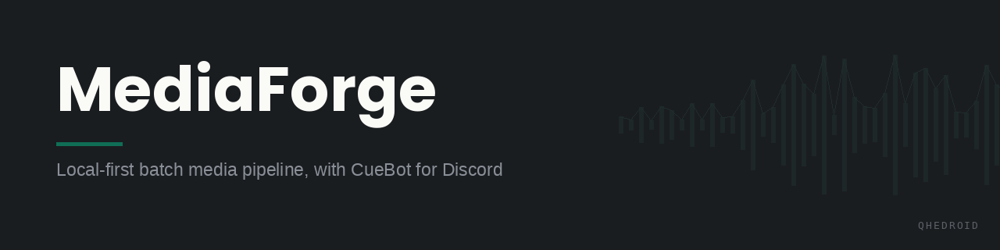

<div align="center">
  
</div>

<br>


MediaForge is a local-first batch media processing pipeline for repeatable media asset workflows.

MediaForge demonstrates pipeline design, repeatable automation, local-first tooling, batch processing, operational thinking, testing and CI discipline, and documentation for handover.

## Problem Statement

Small media projects often need the same preparation steps repeated across many files: inspect the source, create a playback-ready derivative, store predictable outputs, and document what happened. Doing that manually is slow, inconsistent, and hard to hand over.

MediaForge provides a simple TypeScript pipeline that turns those repeated local media preparation steps into a predictable plan. It is designed for portfolio demonstration, local media workflows, and legally permitted assets that the user owns or has permission to process.

## What MediaForge Does

MediaForge reads a JSON pipeline config, resolves local input files, orders the requested processing stages, builds FFprobe/FFmpeg command plans, generates stable output paths, and supports dry-run verification before any processing is attempted.

The repository also includes CueBot, a Discord bot that uses the same `packages/media-core` media preparation layer. CueBot is a companion demo of the reusable media tooling, while MediaForge is the local batch pipeline surface.

## Why It Exists

MediaForge exists to show how a media workflow can be made repeatable, testable, and easy to operate without becoming a SaaS platform or relying on external services. The project emphasizes clear boundaries, deterministic local behavior, CI-backed confidence, and documentation that another engineer can follow.

## Key Features

- Config-driven local batch pipeline.
- Deterministic stage ordering: `probe`, `transcode`, then `metadata`.
- Dry-run mode that validates inputs and prints the planned commands.
- Stable output path generation with configurable output names and formats.
- FFprobe and FFmpeg command construction isolated from the CLI entry point.
- Meaningful Node test suite for parsing, planning, dry-run behavior, and failure handling.
- Reusable `media-core` package for media preparation services used by CueBot.
- Local storage folders for temporary, output, and metadata artifacts.

## Tech Stack

- TypeScript
- Node.js 22+
- pnpm workspaces
- Node's built-in test runner
- FFmpeg and FFprobe command planning
- `discord.js` and `@discordjs/voice` for the companion CueBot app

## How The Pipeline Works

1. Read a JSON config file.
2. Validate `outputDir`, `targetFormat`, and asset entries.
3. Resolve local input files from `inputDir`.
4. Normalize requested stages into the supported execution order.
5. Generate output and metadata paths.
6. Build per-stage command plans.
7. In dry-run mode, print the plan without running media tools.
8. In execution mode, run stages through an injected command runner and surface failures with stage context.

Supported stages:

| Stage | Purpose |
|---|---|
| `probe` | Inspect source media with FFprobe. |
| `transcode` | Build an FFmpeg command for a playback-ready derivative. |
| `metadata` | Prepare metadata output for handover and downstream tooling. |

## Installation

Requirements:

- Node.js 22.12+
- pnpm 9+
- FFmpeg and FFprobe on `PATH` for real media processing

Install dependencies and build:

```bash
pnpm install
pnpm build
```

## Usage

Create a local config file such as `mediaforge.config.json`:

```json
{
  "inputDir": "sample-input",
  "outputDir": "storage/mediaforge-output",
  "targetFormat": "mp3",
  "assets": [
    {
      "input": "demo-track.wav",
      "outputName": "demo-track-ready",
      "stages": ["metadata", "probe", "transcode"]
    }
  ]
}
```

Add a small local media fixture at `sample-input/demo-track.wav`, then run a dry-run:

```bash
pnpm --filter @mediaforge/mediaforge-cli start -- --config mediaforge.config.json --dry-run
```

Example output:

```text
MediaForge dry-run plan: 1 job(s)
- demo-track.wav -> /absolute/path/storage/mediaforge-output/demo-track-ready.mp3
  probe: ffprobe -v error -show_format -show_streams /absolute/path/sample-input/demo-track.wav
  transcode: ffmpeg -hide_banner -y -i /absolute/path/sample-input/demo-track.wav -vn /absolute/path/storage/mediaforge-output/demo-track-ready.mp3
  metadata: node -e console.log(JSON.stringify(...))
```

Expected result: dry-run mode confirms the input exists, shows the normalized stage order, and prints the commands that would be used. It does not create media outputs or require large files.

## How To Verify It Works

1. `pnpm install && pnpm build` completes without errors.
2. `pnpm test` reports all tests passing.
3. The dry-run command above prints a plan with stages ordered `probe`, `transcode`, `metadata` and exits with code 0.
4. Pointing `--config` at an invalid config (for example an unsupported stage name) prints a clear `MediaForge failed:` message and exits with code 1.

## Testing

Run the test suite:

```bash
pnpm test
```

The tests cover:

- Pipeline stage ordering.
- Config parsing and invalid config handling.
- JSON config loading.
- Output path generation.
- FFprobe/FFmpeg command construction.
- Dry-run behavior.
- Missing input handling.
- Stage failure handling.

Additional verification:

```bash
pnpm typecheck
```

## CI

GitHub Actions runs on `push` and `pull_request`.

The workflow checks:

- Dependency installation with `pnpm install --frozen-lockfile`.
- TypeScript build with `pnpm build`.
- Test suite with `pnpm test`.
- Type checking with `pnpm typecheck`.

The workflow uses no secrets, paid services, or external runtime services.

## Project Structure

```text
apps/mediaforge-cli/      MediaForge CLI and pipeline planning logic
apps/cuebot/              Companion Discord bot using media-core
packages/media-core/      Reusable media ingestion, conversion, metadata, and provider services
packages/shared/          Shared TypeScript contracts
docs/                     Architecture, local setup, usage, and project notes
scripts/                  Local validation and setup scripts
storage/                  Ignored local temp/output/metadata folders with .gitkeep files
```

## Documentation

- [Architecture](docs/architecture.md)
- [Command reference](docs/commands.md)
- [Local environment guide](docs/local-env.md)
- [Legal and usage notes](docs/legal-and-usage.md)
- [Version roadmap](docs/version-roadmap.md)

## Limitations

- MediaForge is local-first and intentionally not a hosted product.
- Dry-run planning is the safest demo path; full processing requires FFmpeg and FFprobe installed locally.
- The CLI focuses on batch planning and workflow shape, not polished interactive UX.
- The project is not a downloader, piracy tool, streaming bypasser, production SaaS, or enterprise platform.
- Docker is intentionally absent because there is no verified container workflow in this repository.

## Roadmap

- Add a concrete command runner for non-dry-run MediaForge execution.
- Write metadata JSON files as a first-class pipeline artifact.
- Add fixture-based media tests with tiny generated sample files.
- Improve CLI argument validation and help output.
- Consider Docker only if a verified container workflow genuinely improves local handoff.

## Portfolio Signal

MediaForge is ready to evaluate as a portfolio project because it has a launch-ready README, meaningful tests, CI, useful architecture docs, and a clear local demo path. Docker is intentionally absent and listed as a future option rather than claimed as an implemented capability.

Expected PortfolioOps checklist:

| Signal | Status |
|---|---|
| README | Present and launch-ready |
| Tests | Present and meaningful |
| CI | Present and expected to pass |
| Docs | Present and useful |
| Docker | Intentionally absent |

---

<div align="center">
  <sub>qhedroid · part of the <a href="https://www.linkedin.com/in/noelquadri2001">Noel Quadri</a> portfolio</sub>
</div>
