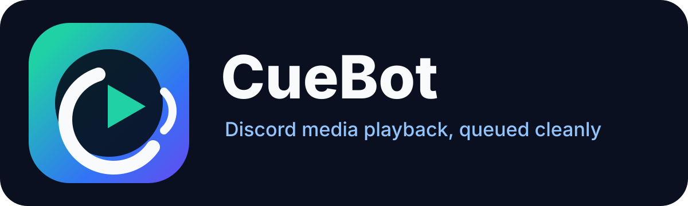

# CueBot



CueBot is a Discord music bot powered by MediaForge. It supports uploaded files, direct URLs, YouTube search, button-based result selection, voice playback, queue controls, and local-first media preparation.

MediaForge + CueBot is a TypeScript portfolio project that shows a clean split between Discord orchestration and reusable media tooling. CueBot owns commands, interactions, queues, and voice sessions. `packages/media-core` owns ingestion, probing, conversion, resolver plumbing, and cleanup.

Only use CueBot with media you own or have permission to play.

## Current Features

- `/play attachment:<file>` for Discord-uploaded audio/video files.
- `/play url:<url>` for direct media URLs and supported resolver URLs.
- `/search query:<song>` with up to 5 YouTube results and Play buttons.
- `/spotify playlist:<url>` for Spotify metadata-only playlist import.
- Voice playback in the requester's voice channel.
- Queue controls: `/queue`, `/nowplaying`, `/pause`, `/resume`, `/skip`, and `/stop`.
- `/help` for in-Discord usage guidance.
- FFmpeg/FFprobe preparation for MP3, WAV, M4A, OGG, WEBM, and MP4.
- Temporary file cleanup under `storage/cuebot-temp`.
- Secret scanning for committed project files.

## Commands

| Command | Purpose |
|---|---|
| `/help` | Show commands and usage notes. |
| `/ping` | Check CueBot is online. |
| `/search query:<song>` | Search YouTube and choose a result with buttons. |
| `/spotify playlist:<url>` | Import Spotify playlist metadata and queue matched results. |
| `/play attachment:<file>` | Play an uploaded Discord audio/video file. |
| `/play url:<url>` | Play a direct media URL or supported resolver URL. |
| `/play result:<n>` | Text fallback for a cached `/search` result. |
| `/queue` | Show the current queue. |
| `/nowplaying` | Show the current track. |
| `/pause` | Pause playback. |
| `/resume` | Resume playback. |
| `/skip` | Skip the current track. |
| `/stop` | Stop playback, clear the queue, disconnect, and clean temp files. |

## Quick Setup

Requirements:

- Node.js 22.12+
- pnpm 9+
- FFmpeg and FFprobe on `PATH`, or configured in `.env`
- yt-dlp on `PATH`, or configured with `YTDLP_PATH` in `.env`
- Spotify Web API credentials for playlist import
- A private Discord test server and bot application

Install and build:

```powershell
pnpm install
pnpm build
pnpm secret:check
pnpm ytdlp:check
```

Create a local `.env` in the repository root from `.env.example`. Do not commit `.env`.

Register commands and start CueBot:

```powershell
pnpm --filter @mediaforge/cuebot register
pnpm --filter @mediaforge/cuebot start
```

## Demo Flow

1. Start CueBot and keep the terminal visible.
2. In Discord, join a voice channel.
3. Run `/help`.
4. Run `/play attachment:<file>` with a small MP3.
5. Run `/search query:<song>`.
6. Click a Play button and watch CueBot prepare, queue, and play the selection.
7. Run `/queue`, `/pause`, `/resume`, `/skip`, and `/stop`.

## Deployment

Recommended production path:

- **M4 Mac mini / home server** for full CueBot functionality, especially YouTube playback.
- The Mac mini can run 24/7 while the Windows PC is off.
- It uses the home/residential network instead of a cloud/datacentre IP.
- See [docs/deployment-home-server-mac.md](docs/deployment-home-server-mac.md).

Alternative:

- **Oracle Cloud Always Free** is useful for 24/7 bot uptime, attachment playback, direct media URLs, command testing, and non-YouTube features.
- YouTube playback may be blocked by cloud/datacentre IP reputation.

## Branding

CueBot branding guidance and Discord description text live in [docs/branding.md](docs/branding.md).

## Architecture

- `apps/cuebot`: Discord commands, button interactions, queues, voice sessions, and runtime.
- `apps/mediaforge-cli`: local MediaForge CLI shell.
- `packages/media-core`: reusable media ingestion, FFmpeg/FFprobe preparation, URL resolver support, provider/search helpers, and cleanup.
- `packages/shared`: shared TypeScript types.
- `storage`: local ignored temp/output/metadata folders.
- `scripts`: local setup and validation scripts.

CueBot does not contain FFmpeg, download, conversion, or resolver implementation details directly. It delegates media preparation to `media-core`.

## Legal-Use Note

CueBot is for local development and legally permitted media playback: your own files, public-domain content, Creative Commons-licensed content, direct media URLs you are allowed to use, and content the rights holder permits you to play. It is not intended as piracy tooling.

## Roadmap

| Milestone | Focus | Status |
|---|---|---|
| CueBot 0.1 | Uploaded file playback and queue controls | Implemented |
| CueBot 0.2 | Direct URL and resolver-backed URL playback | Implemented |
| CueBot 0.3 | YouTube search with button-based selection | Implemented |
| CueBot 0.4 | Branding, docs, demo flow, UX stability | In progress |
| CueBot 0.5 | Spotify playlist metadata import | Implemented |
| CueBot 1.0 | Polished embeds, button controls, persistence, attribution, and demo-ready reliability | Planned |
| MediaForge | Desktop/CLI polish for local media preparation | Planned |

Future ideas include playlist playback controls and expanded Spotify metadata display. Playback provider expansion should stay inside `media-core` or MediaForge-owned resolver/provider boundaries.

## Tech Stack

- TypeScript
- Node.js 22+
- pnpm workspaces
- discord.js
- @discordjs/voice
- FFmpeg and FFprobe
- yt-dlp
- JSON metadata for MVP local storage
- Windows-first local development

## Docs

- [Branding](docs/branding.md)
- [Command reference](docs/commands.md)
- [Local environment guide](docs/local-env.md)
- [Discord test server setup](docs/discord-test-server-setup.md)
- [YouTube search design](docs/youtube-search-design.md)
- [URL playback design](docs/url-playback-design.md)
- [Production environment](docs/production-env.md)
- [Mac mini home-server deployment](docs/deployment-home-server-mac.md)
- [Version roadmap](docs/version-roadmap.md)
- [Spotify playlist import](docs/spotify-playlist-import.md)
